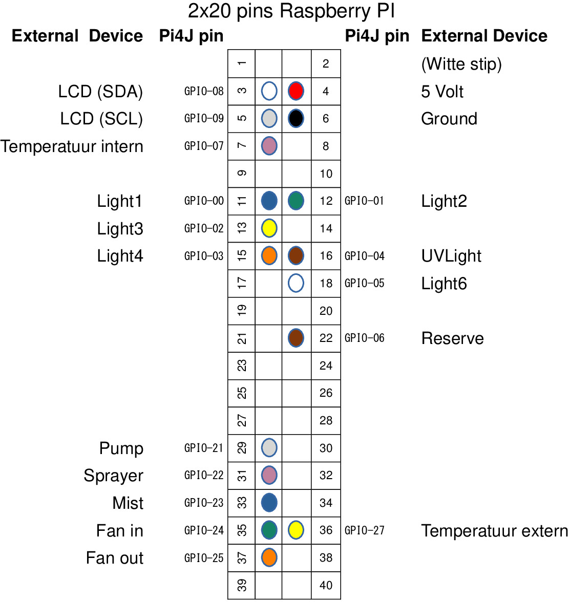

# Terrarium Control Unit running in a JVM on a Raspberry Pi 3+

## The Hardware
The Raspberry Pi3+ has a Wifi and Bluetooth module for remote communication and a 40-pins GPIO connector with the following connections:

The TCU controls the devices:
* AM2302 Temperature and Humidity sensor
* DS18B20 Temperature sensor
* LCD unit (16x2) for displaying sensor information
* 12 on/off relais for switching lights, pump, sprayer, mist, fan-in and fan-out

### The Logic
There are two types of logic implemented:
* Timers
* Rules

#### Timer logic
There are two types of timers:
* On/Off Timers  
These timers have an on-time expressed as HH:mm and a off-time expressed as HH:mm
* Period Timers   
These timers have an on-time expressed as HH:mm and no off-time but a period of max 3600 seconds

#### Rule logic
There are two types of rules:
* Rule that manages the temperature
    * When the temperature drops below the ideal temperature what are the actions to take
    * When the temperature rises above the ideal temperature what are the actions to take
* Rule that manages the actions after the Sprayer device has been activated (drying rule).
    * When the sprayer has been switched off then after a delay-period what are the actions to take

#### Specific device related logic
* the Mist device  
When the Mist device is switched on then the Fan-in and Fan-out devices are always switched off
* the Sprayer device  
When the Sprayer device is switched on then the Fan-in and Fan-out devices are always switched off

## The Software
The software consist of two main parts:
* Terrarium Management
* Terrarium Management Configuration
    * using Bluetooth
    * using Wifi

### Terrarium Management
The motor of the TCU is the `TCU.java` file. It initializes and configures the hardware and logic defined in the `Terraria.java` file,
starts a Timer and schedules an EachSecondTask, EachMinuteTask and an EachHourTask.

* The EachSecondTask (`EachSecondTask.java`)executes the logic that needs to be executed every second.  
Since there are Period Timers that have a accuracy in seconds each second the timers are checked.  
 
* The EachMinuteTask (`EachMinuteTask.java`) executes the logic that needs to be executed every minute.  
The rules are checked each minute.  
 
* The EachHourTask (`EachHourTask.java`) executes the logic that needs to be executed every hour.  
The Lifecycle counter that can be linked to a Light device is updated each hour.  
The Trace function is switched on on a full hour.  

### Terrarium Management Configuration
The data that can be set is defined in the `TerrariumConfig.java` class. This class is converted to JSON and stored on disk in the `settings.json` file on each change in the configuration. It is read in whenever the Pi is rebooted.  
For the TCU configuration two services are implemented each with its own API:
* a Bluetooth service
* a REST webservice using Wifi

#### using Bluetooth
The Bluetooth service implements a BluetoothSocket listener (see `BTServer.java`). Each Bluetooth device must have its own unique UUID. This UUID is defined in the `config.properties` file. It also needs a host name, also defined in the `config.properties` file.  
When the TCU is started this name is broadcasted so any Bluetooth client can receive it.

The Bluetooth service is a Request/Response message service. The Request received is a JSON string converted to a Command object (`Command.java`) which contains a unique messageId, a command and a JsonObject which contains the data that is linked to the command.

#### Bluetooth API

##### getProperties

__Data__ : None

__Response__ :
<pre><code>{"tcu":"TERRARIUMPI","nr_of_timers":23,"nr_of_programs":2,"devices":[
{"device":"light1", "nr_of_timers":1, "lc_counted":false},
....
]}</code></pre>

##### getSensors

__Data__ : None

__Response__ :
<pre><code>{"clock": "08-03-2023 19:19", 
 "sensors": [ {"location":"room", "temperature":21, "humidity":45 },{"location":"terrarium", "temperature":26} ]
}</code></pre>

#### using Wifi
The REST webservice implements a HTTPSocket listener on a IP address that the Pi OS gets from the DHCP service on the local network. The port number is 80 (see `RestServer.java`).
